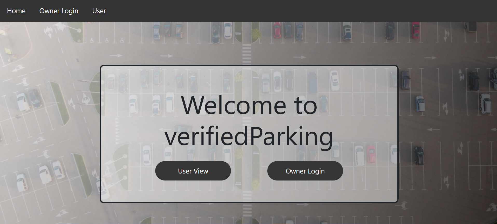
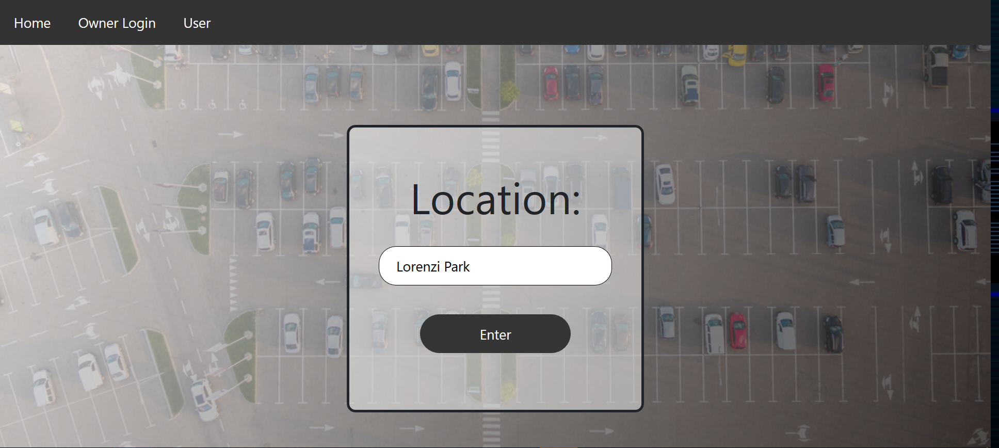
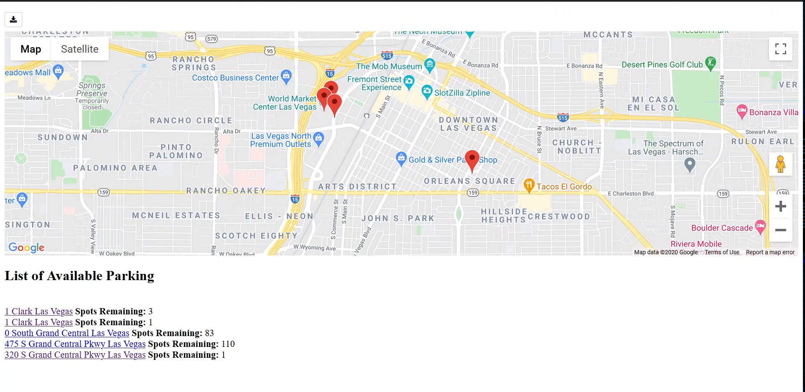
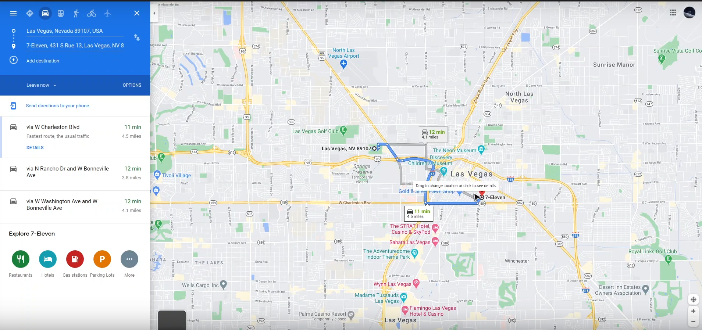

# Overview 
verfidiedParking is a web application that suggests nearby parking lots given a location. The user enters the target location and the verifiedParking will suggest the closed parking lots. verifiedParking also returns the hourly rate and capacity of each parking lot. The user can also find nearby parking lots using their current location. verifiedParking is an web app that allows user to find parking lots hassle-free.

# Screenshots
## Home

## Find Parking

## Available Parking Lots

## Route to Parking Lot

